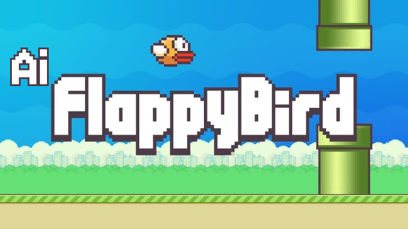
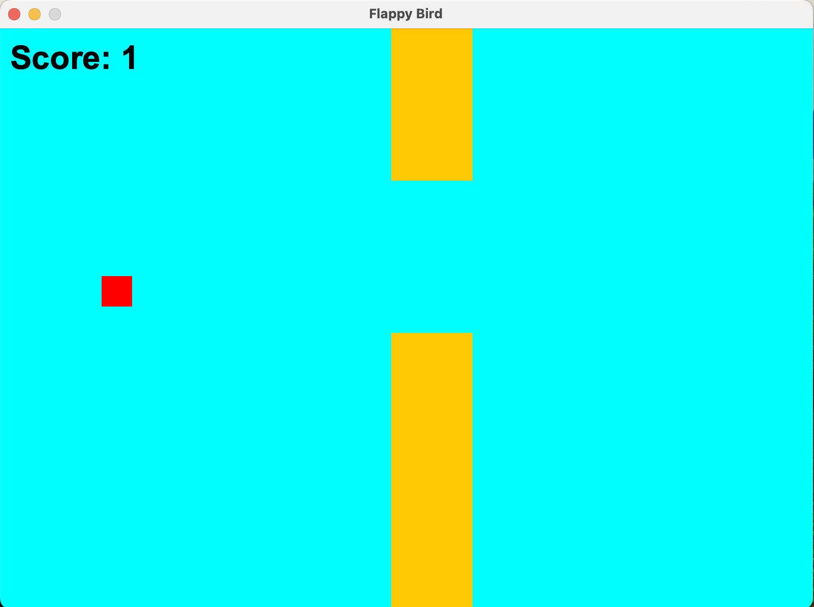
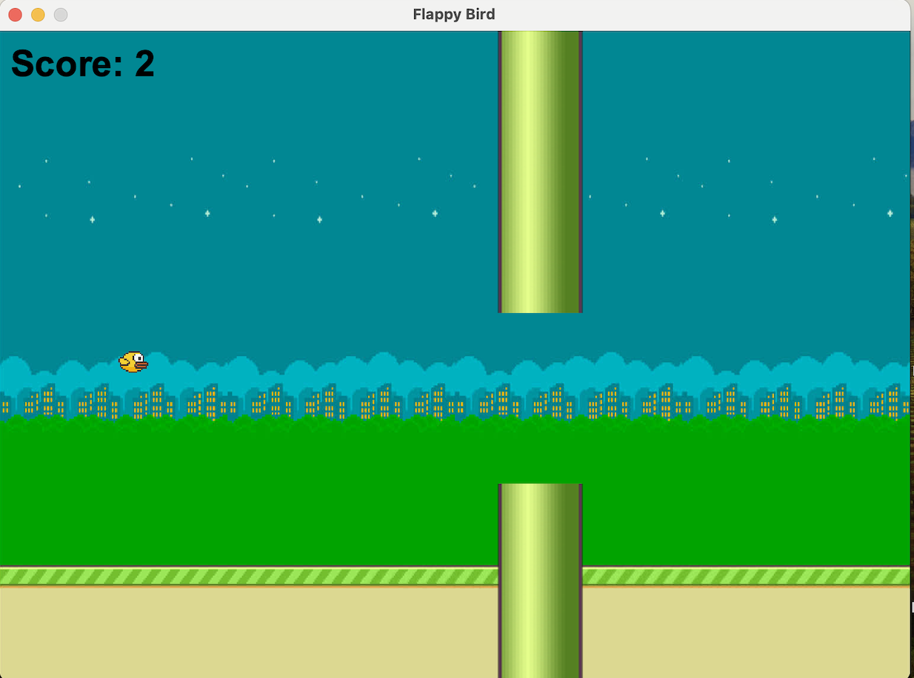

<p align="center">
  
</p>

# Flappy Bird in Java 🎮

A simple recreation of the classic Flappy Bird game built with Java Swing.This project features smooth bird movement, randomly generated pipes, collision detection, and score tracking — all packed into a lightweight desktop game.


## ✨ Features:
* Bird physics with gravity & flap mechanics
* Procedural pipe generation
* Collision detection and game-over state
* Score display and restart option
* Clean and beginner-friendly code

### 🚀 How to Run:
1. Clone the repo:

```bash
git clone https://github.com/Aaleen110/flappy-bird-java.git
```

### 2. Compile:
```bash
javac FlappyBirdGame.java GamePanel.java
```

### 3. Run:
```bash
java FlappyBirdGame
```

### Controls:
* Space — Flap
* R — Restart


### Prompts used & Screenshots

*Prompt 1:*
Build a Flappy Bird game in Java. Use Swing. Implement gravity, pipes, jumping, scoring, and collision detection. Keep it simple but playable.

After Prompt 1 (Basic Version)


*Prompt 2:*
Now, polish the Flappy Bird game: add background images, custom bird and pipe images, sound effects for jump/collision/scoring, smoother animations. Also list the required assets.
(Also added the listed assets to specified folder)
After Prompt 2 (Polished Version)


Prompt engineering made this project faster, cleaner, and a lot more fun! 🚀

### About
This project showcases how AI-powered development and smart prompts can help build real-world applications in minutes, not hours.

Check out the full story 👉 
https://aaleenmirza110.medium.com/how-i-built-flappy-bird-in-minutes-using-ai-in-just-2-prompts-dc481092cad0

### Support
If you found this project helpful, interesting, or fun:
Please consider giving a ⭐ to the repository — it really motivates!


